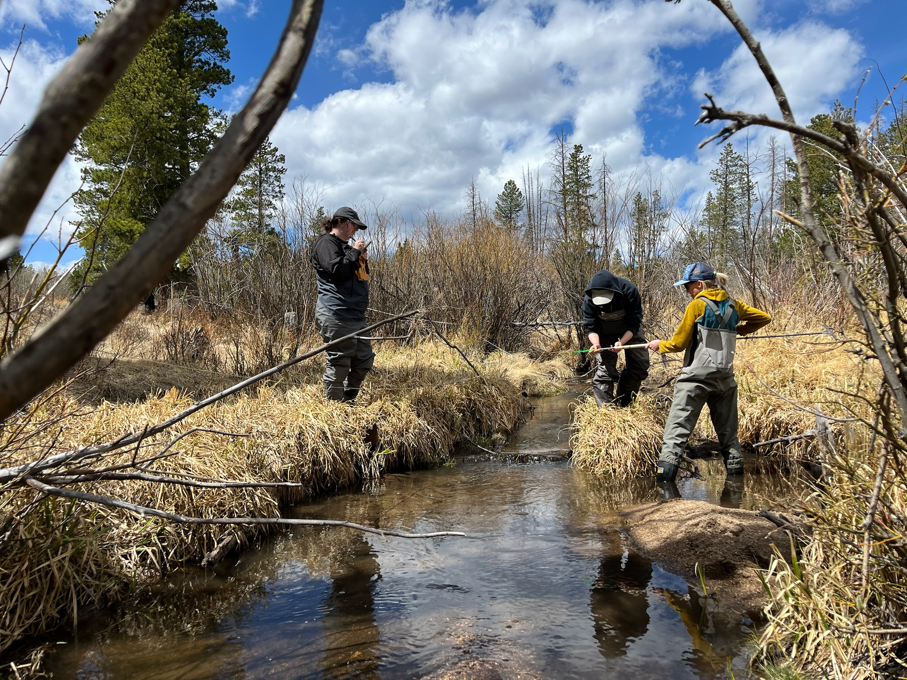
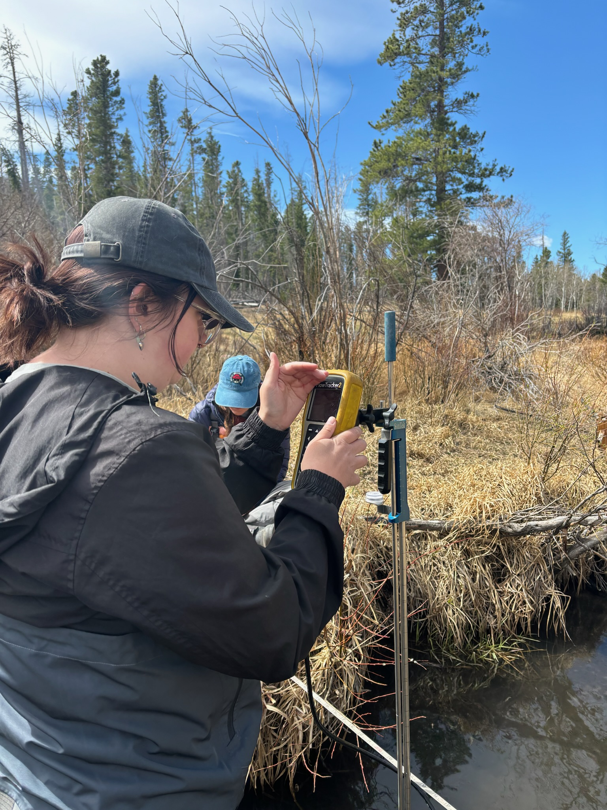

Assessing and collecting data from a burned area at CSU's Mountain Campus

Assessing Roberts Tunnel Outlet

Collecting watershed data and measurements using a headrod at the Mountain 
Campus

Collecting stream data in the Lower Elkhorn River

Using a FlowTracker to measure velocity at an upstream site in the Lower Elkhorn River

---

*More photos and projects coming soon!*
