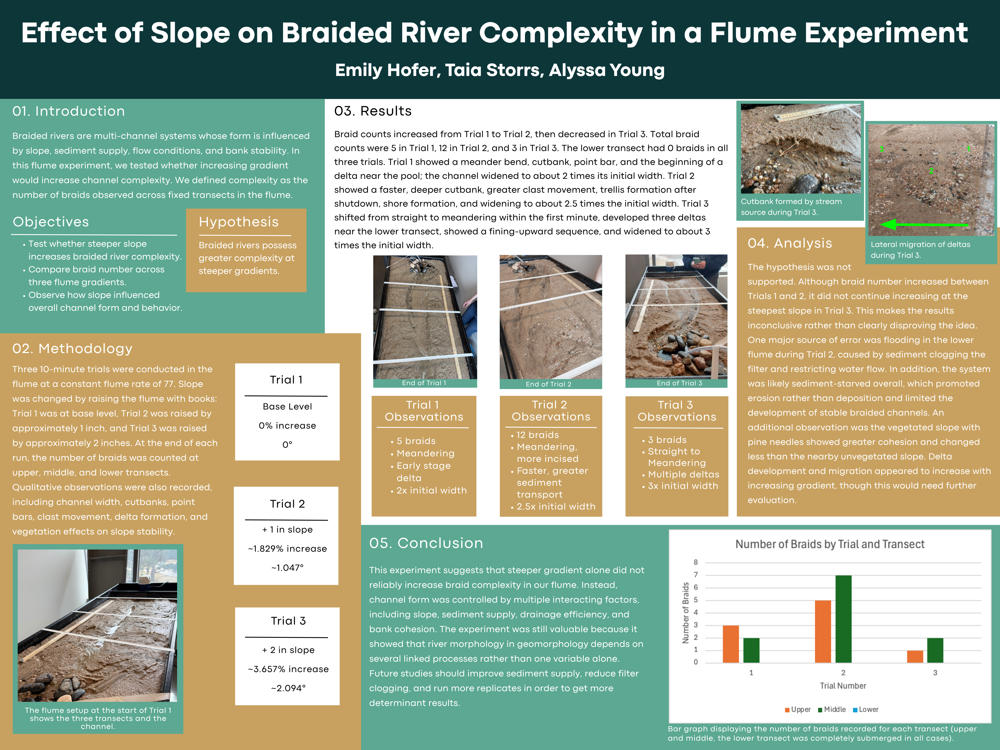
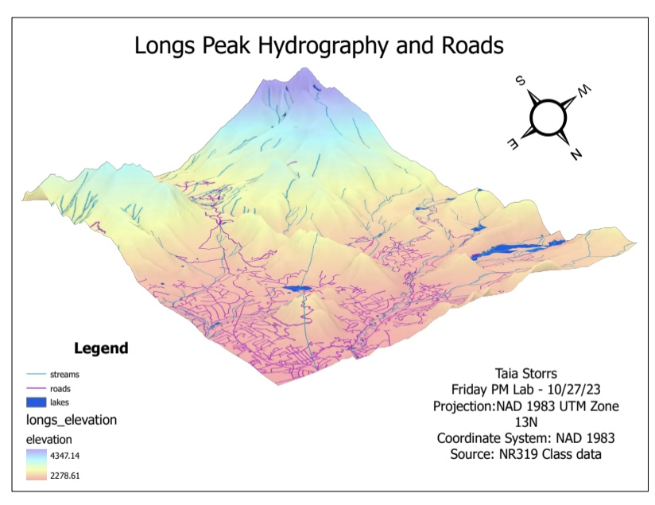

## Sustainability and Water Science Projects

### Effect of Slope on Braided River Complexity in a Flume Experiment
**Colorado State University – Geomorphology | Spring 2026**

- Tested whether increasing flume gradient would increase braided river channel complexity
- Conducted three 10-minute trials at varying slopes, counting braids across upper, middle, and lower transects
- Recorded qualitative observations including channel width, cutbanks, point bars, clast movement, and delta formation
- Results were inconclusive — braid count did not increase consistently with slope, suggesting channel form is controlled by multiple interacting factors

{width=100%}

### Horsetooth Reservoir Limnology Lab Report
**Colorado State University – Limnology | Fall 2024**

- Collected and analyzed depth profiles of temperature, dissolved oxygen, pH, 
conductivity, and chlorophyll-a at Horsetooth Reservoir
- Measured total nitrogen, dissolved organic carbon, and Secchi depth across 
epilimnion and hypolimnion
- Visualized water quality parameters in R using ggplot2 and compared findings 
to EPA data from Dillon Reservoir
- Results indicated eutrophic conditions based on elevated nitrogen levels and 
Secchi depth measurements

[View Final Report](ess474_final-report.html){.btn .btn-primary}
[View Final Report with Code](ess474_final-report-code.html){.btn .btn-primary}

### Center for Participatory Science Development
**Colorado State University – Practicing Sustainability | Spring 2025**

Collaborated with stakeholder CitSci to design systems 
for CSU's upcoming Center for Participatory Science:

- Wrote a background paper highlighting barriers and 
strategies for inclusive research
- Built a participant database using Airtable and Fillout
- Implemented communication systems via Teams, 
Outlook/Gmail, and Calendly

### Statistical Comparison of Sea Ice and Global Sea Level
**Colorado State University – Quantitative Reasoning for Ecosystem Science | Spring 2024**

Conducted statistical analyses in RStudio to quantify 
correlations between sea ice extent and global sea level 
rise:

- Merged and cleaned satellite-derived datasets
- Ran correlation tests (Pearson's r = -0.48) and 
visualized spatial/temporal trends
- Presented findings demonstrating a significant negative 
correlation between polar ice melt and global sea level 
rise

[Statistcal Comparison](ess330_final-project.pdf){width=100%}

### Longs Peak Hydrography and Road Map
**Colorado State University – Introduction to Geospatial Science | Fall 2023**

- Applied ArcGIS to integrate hydrology and transportation datasets
- Created a map of Longs Peak's hydrography and road 
networks to demonstrate spatial data visualization skills

